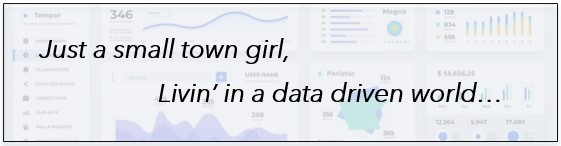

  

## Portfolio Spotlight

### Introduction

Hello! You've landed on the portfolio page for Sherry Kosmicki. I just graduated from Bellevue University with my Masters degree in Data Science. I've worked for a corporate hospital system for over 25 years. Working in Finance has given me a wide range of experience using data and building time-saving solutions. During the COVID lockdown I made the conscious decision to go back to school and learn something new. I learned a new coding language and have a greater understanding of statistics concepts. I've included links to some of the various projects I completed throughout my masters program.

### Graduation Rates Project

This project uses national education statistics and attempts to predict which type of academic institution to choose based on higher graduation rates. Analysis was also done to determine if there is a correlation between those students that receive aid vs those that do not receive aid and the graduation rates.
#### [Link to Graduation Rates Project Proposal](https://github.com/sherkozmo/sherkozmo.github.io/blob/Graduation-Rates/DSC680%20P1%20Milestone%201%20Proposal%20Sherry%20Kosmicki.pdf)

### Airline Crash Analysis

This project was a deep dive in the various visualizations you can create to display data. I built a dashboard, an executive summary, blog post, info graphic and final presentation. While developing these different visualization products I had to consider format, color, ethics and content relative to the audience receiving the information. 
#### [Link to Dashboard](https://github.com/sherkozmo/sherkozmo.github.io/blob/Airline-Project/Term%20Project%20Dashboard%20SKosmicki.pdf)
#### [Link to Infographic](https://github.com/sherkozmo/sherkozmo.github.io/blob/Airline-Project/Term%20Project%20Milestone%20Infographic%20SKosmicki.pdf)

### Amazon Review Words Evaluation

This was an opportunity to use the bag of words feature in Python and connect the code with in a Power BI presentation. The goal was to provide commonly used words within an Amazon Review in an interactive dashboard. Once perfected it could be used with any review dataset.

### Predicting Fuel Efficiency

This project walks through the steps of data analysis and modeling of vehicle data to include mpg and other relative variables. The data was cleaned, dummy variables created, and two distinct types of modeling were applied to the train and test data sets.
#### [Link to Jupyter Notebook code](https://github.com/sherkozmo/sherkozmo.github.io/blob/Predicting-Fuel-Efficiency/Exercise%204.2%20Predicting%20Fuel%20Efficiency%20Sherry%20Kosmicki.ipynb)
#### Heat map - Predicting Fuel Efficiency

### Food Delivery Service Tip Prediction

Food service tip amounts normally can be based on total food service purchased. In this analysis I looked for other variables that could potentially impact the tip awarded such as race, payment type, age of customer or where their home resides. From this information I can predict which variables can determine if the delivery person receives a higher tip amount.

### Sentiment Analysis Model

The goal of this project was to use machine learning techniques to look at pieces of text and determine the sentiment within the data – positive, negative, or neutral. The text is transformed into a bag of words model using tf-dif vectorization.

### The Return of the King LSTM Text Generator

This project took a downloaded txt file of The Return of the King book from the Lord of the Rings series. I then used the text to create a LSTM deep learning text generator. This process created a list of unique characters and was modeled using a next-character prediction. Lastly, I looped the data into a text generator.

### Movie Rating Data from Three Sources

The goal of this project was to bring together three different data sources and join them using python code. The sources I chose were a csv file, url data, and an api connection. Once the data was combined and cleaned, I built different visualizations to evaluate.

### Loan Approval Analysis

This project looked at various variables that could be used during the loan application process to predict approval. Several models were used for this project to determine the best possible option. I created a dictionary of learning algorithms and added hyperparameters to look for the best model without data.
